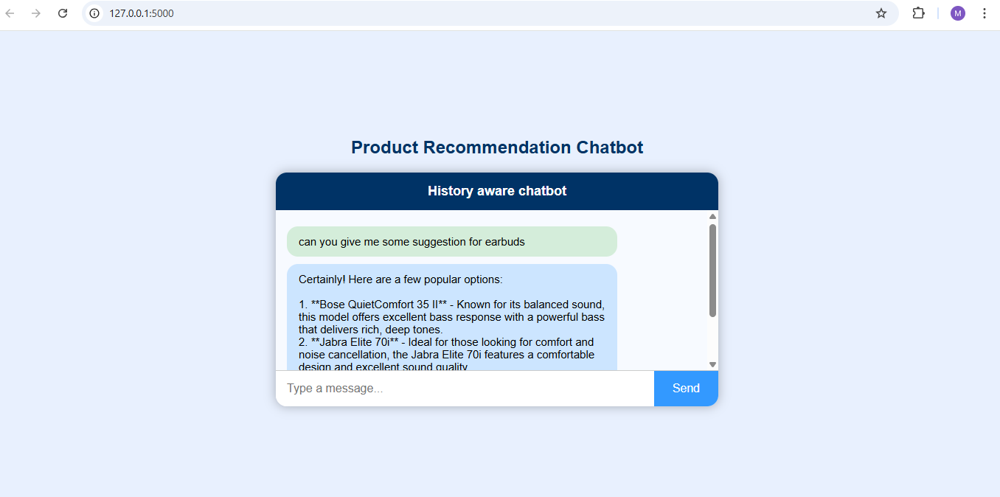

# 🛍️ Product Recommendation Chatbot

A sophisticated RAG (Retrieval-Augmented Generation) based chatbot that provides intelligent product recommendations using Flipkart product reviews and ratings. The system leverages advanced NLP techniques to understand user queries and deliver contextually relevant product suggestions.



## 🎯 Features

- **Intelligent Product Recommendations**: Uses RAG architecture to provide contextually aware product suggestions
- **Conversational Memory**: Maintains chat history for personalized interactions
- **Real-time Processing**: Fast response times with optimized retrieval mechanisms
- **Scalable Architecture**: Deployed on AWS with full CI/CD pipeline
- **Vector Database Integration**: Utilizes Astra DB for efficient similarity search
- **Docker Containerization**: Fully containerized for consistent deployments

## 🏗️ Architecture

```
┌────────────┐
│ User Input │ ◄─── ("what about battery life?")
└─────┬──────┘
      │
      ▼
────────────────────────────────────────────────────
        📦 RunnableWithMessageHistory
────────────────────────────────────────────────────
      │
      ▼
🧠 get_session_history(session_id)
┌────────────────────────────────────┐
│ Fetch or create per-user chat log │
└────────────────────────────────────┘
      │
      ▼
────────────────────────────────────────────────────
    🧠 create_history_aware_retriever()
────────────────────────────────────────────────────
      │
      │ Reformulate input using model + history:
      │   ➤ "What is the battery life of the best bluetooth buds?"
      ▼
  🔍 Retriever.as_retriever(k=3)
┌────────────────────────────────────┐
│ Search vector DB (Astra) for top 3 │
│ matching product reviews/titles    │
└────────────────────────────────────┘
      │
      ▼
────────────────────────────────────────────────────
      create_stuff_documents_chain()
────────────────────────────────────────────────────
      │
      ▼
📝 Prompt Template:
  - Injects `context` from retrieved docs
  - Injects user `input` (reformulated)
  - Adds system instructions
      │
      ▼
🤖 Ollama / LLM (qwen2.5:0.5b)
  - Generates concise, product-aware response
      │
      ▼
🧾 Output
"These buds offer up to 30 hours of battery life..."
```

## 📁 Project Structure

```
├── .dockerignore
├── .github
│   └── workflows
│       └── main.yaml                 # CI/CD Pipeline configuration
├── .gitignore
├── Dockerfile                        # Container configuration
├── PRODUCT_REIVIEW/
│   ├── __init__.py
│   ├── data_converter.py            # Data preprocessing utilities
│   ├── data_ingestion.py            # Vector database ingestion
│   └── retrieval_generation.py      # RAG implementation
├── README.md
├── Results/                         # Demo screenshots
│   ├── results_1.png
│   ├── results_2.png
│   ├── results_3.png
│   └── results_4.png
├── app.py                          # Flask web application
├── data/
│   └── flipkart_product_review.csv # Product review dataset
├── requirements.txt                # Python dependencies
├── setup.py                       # Package setup
├── template.py                    # Project template generator
└── templates/
    └── index.html                 # Web interface
```

## 🚀 Tech Stack

- **Frontend**: HTML, CSS, JavaScript
- **Backend**: Python, Flask
- **ML/NLP**: LangChain, Ollama (qwen2.5:0.5b)
- **Vector Database**: Astra DB (Cassandra)
- **Embeddings**: Hugging Face Transformers
- **Containerization**: Docker
- **Cloud**: AWS (ECR, EC2)
- **CI/CD**: GitHub Actions
- **Data**: Flipkart Product Reviews Dataset

## ⚙️ Installation & Setup

### Prerequisites

- Python 3.11+
- Docker
- AWS Account
- Astra DB Account
- Groq API Key
- Hugging Face Token

### Local Development

1. **Clone the repository**
   ```bash
   git clone <repository-url>
   cd product-recommendation-chatbot
   ```

2. **Install dependencies**
   ```bash
   pip install -r requirements.txt
   ```

3. **Set up environment variables**
   ```bash
   export GROQ_API_KEY="your_groq_api_key"
   export ASTRA_DB_API_ENDPOINT="your_astra_db_endpoint"
   export ASTRA_DB_APPLICATION_TOKEN="your_astra_db_token"
   export ASTRA_DB_KEYSPACE="your_keyspace"
   export HF_TOKEN="your_hugging_face_token"
   ```

4. **Run the application**
   ```bash
   python app.py
   ```

5. **Access the chatbot**
   Open your browser and navigate to `http://localhost:5000`

### Docker Deployment

1. **Build the Docker image**
   ```bash
   docker build -t product-recommendation-chatbot .
   ```

2. **Run the container**
   ```bash
   docker run -d -p 5000:5000 \
     -e GROQ_API_KEY="your_groq_api_key" \
     -e ASTRA_DB_API_ENDPOINT="your_astra_db_endpoint" \
     -e ASTRA_DB_APPLICATION_TOKEN="your_astra_db_token" \
     -e ASTRA_DB_KEYSPACE="your_keyspace" \
     -e HF_TOKEN="your_hugging_face_token" \
     product-recommendation-chatbot
   ```

## ☁️ AWS Deployment

The project includes a complete CI/CD pipeline using GitHub Actions that automatically:

1. **Continuous Integration**:
   - Code linting
   - Unit testing
   - Quality checks

2. **Continuous Delivery**:
   - Builds Docker image
   - Pushes to AWS ECR
   - Tags with latest version

3. **Continuous Deployment**:
   - Pulls latest image from ECR
   - Deploys to self-hosted AWS EC2 runner
   - Manages container lifecycle

### Required GitHub Secrets

Configure these secrets in your GitHub repository:

```
AWS_ACCESS_KEY_ID
AWS_SECRET_ACCESS_KEY
AWS_DEFAULT_REGION
ECR_REPOSITORY_NAME
AWS_ECR_LOGIN_URI
GROQ_API_KEY
ASTRA_DB_API_ENDPOINT
ASTRA_DB_APPLICATION_TOKEN
ASTRA_DB_KEYSPACE
HF_TOKEN
```

## 📊 Usage Examples

### Basic Product Query
```
User: "Can you recommend some good bluetooth earbuds?"
Bot: "Based on customer reviews, here are the top-rated bluetooth earbuds with excellent sound quality and battery life..."
```

### Follow-up Questions
```
User: "What about their battery life?"
Bot: "The recommended earbuds offer up to 30 hours of total battery life with the charging case, and about 8 hours of continuous playback..."
```

### Specific Feature Inquiry
```
User: "Which ones have noise cancellation?"
Bot: "Among the recommended options, the XYZ model features active noise cancellation with hybrid technology..."
```

## 🔧 Core Components

### Data Ingestion (`data_ingestion.py`)
- Processes Flipkart product review dataset
- Creates embeddings using Hugging Face models
- Stores vectors in Astra DB for similarity search

### RAG Implementation (`retrieval_generation.py`)
- Implements history-aware retrieval chain
- Combines retrieved context with user queries
- Generates contextually relevant responses using Ollama LLM

### Web Interface (`app.py`)
- Flask-based web application
- RESTful API endpoints
- Session management for chat history

## 📈 Performance Features

- **Fast Retrieval**: Vector similarity search with top-k results (k=3)
- **Memory Optimization**: Efficient chat history management
- **Scalable Architecture**: Containerized deployment on AWS
- **Caching**: Optimized data loading and processing
---
